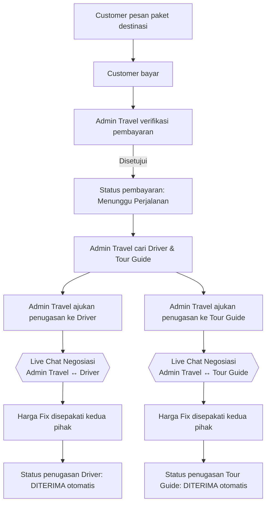
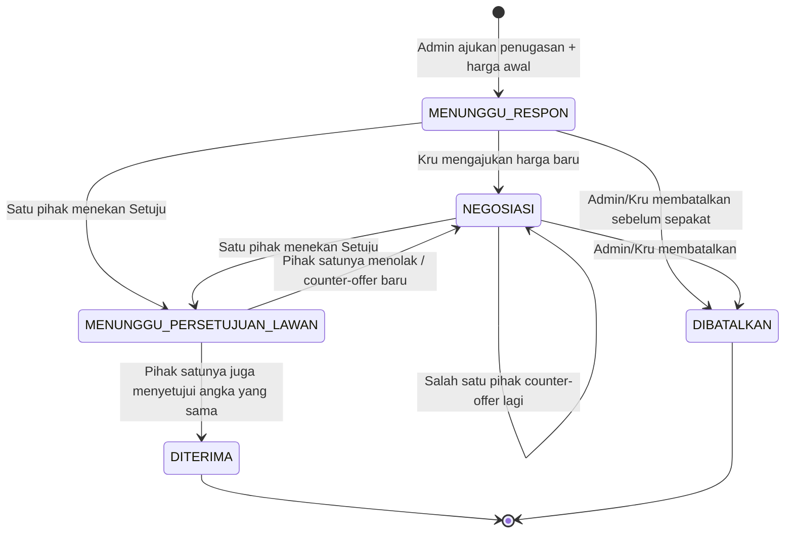
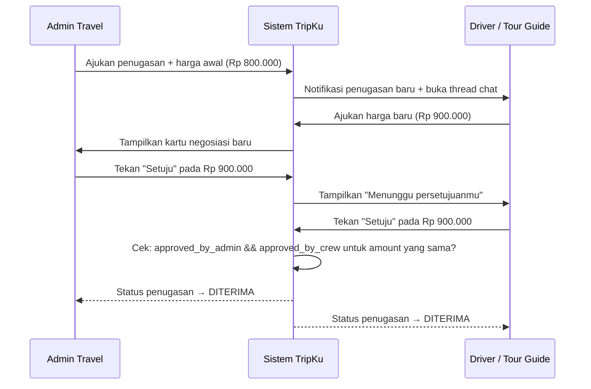

# Desain Fitur Live Chat Negosiasi — TripKu

Dokumen ini merancang fitur **live chat negosiasi harga** antara **Admin Travel ↔ Driver** dan **Admin Travel ↔ Tour Guide**, dengan desain visual mengacu pada referensi popup chat Facebook Messenger yang dilampirkan.

---

## 1. Analisis Referensi Desain

Gambar yang dilampirkan menunjukkan popup chat Messenger di pojok kanan bawah layar, dengan tiga bagian utama:

| Bagian | Elemen | Catatan desain |
|---|---|---|
| **Header** | Avatar kecil (bulat) + nama + badge verifikasi + ikon dropdown (˅) + tombol minimize (–) + tombol close (×) | Header tetap terlihat walau chat di-minimize, jadi user tahu chat mana saja yang sedang terbuka |
| **Body (kosong/awal)** | Avatar besar di tengah + nama + badge verifikasi + teks info keamanan ("Pesan dan telepon diamankan dengan enkripsi end-to-end...") + link "Pelajari selengkapnya" | Ini adalah *empty state* — tampil sebelum ada pesan terkirim. Memberi rasa aman & kredibel di awal percakapan |
| **Footer (composer)** | Ikon mic, ikon gambar, ikon stiker, ikon GIF, input teks "Aa", ikon emoji, ikon jempol (like cepat) | Baris input serba-guna: teks, media, reaksi cepat, semua dalam satu baris |

**Karakteristik yang membuat widget ini terasa ringan dan tidak mengganggu:**
- Ukuran compact (bukan full-page chat), muncul sebagai popup/overlay, bisa di-minimize tanpa menutup percakapan.
- Visual hierarchy jelas: identitas lawan bicara (avatar + nama + badge) selalu jadi fokus utama di bagian atas.
- Satu bar input menampung banyak jenis konten tanpa terasa penuh.

Prinsip-prinsip inilah yang akan diadaptasi untuk TripKu, **ditambah satu elemen baru yang tidak ada di Messenger**: kartu negosiasi harga dengan tombol persetujuan, karena use case TripKu bukan cuma ngobrol tapi juga menyepakati angka.

---

## 2. Tujuan Fitur

Menyediakan kanal komunikasi langsung antara Admin Travel dan kru (Driver / Tour Guide) untuk:
1. Admin Travel mengajukan penugasan beserta harga awal.
2. Kru bisa menegosiasikan harga lewat chat sebelum menerima tugas.
3. Kedua pihak menyepakati harga final lewat mekanisme konfirmasi dua arah (bukan cuma ngetik "oke" di chat — ada tombol eksplisit).
4. Status penugasan otomatis berubah jadi **DITERIMA** begitu kedua pihak sama-sama menyetujui harga final.

---

## 3. Posisi Fitur dalam Alur Bisnis TripKu



Dua chat ini **terpisah dan independen** — Driver tidak melihat chat Admin dengan Tour Guide, begitu pula sebaliknya.

---

## 4. Aktor

| Aktor | Peran dalam chat |
|---|---|
| **Admin Travel** | Memulai percakapan, mengajukan harga awal penugasan, bisa mengajukan ulang harga, menyetujui harga final |
| **Driver** | Menerima pengajuan penugasan, bisa menawar harga, menyetujui harga final |
| **Tour Guide** | Sama seperti Driver, tapi di thread chat yang terpisah |

Satu Admin Travel bisa punya banyak thread chat aktif sekaligus (satu per penugasan per kru), mirip banyak popup chat Messenger yang bisa dibuka bersamaan.

---

## 5. Desain UI — Mapping dari Referensi ke TripKu

### 5.1 Header Chat Widget
Sama seperti referensi, ditambah elemen status penugasan:

```
┌─────────────────────────────────────────────┐
│ [Avatar] Budi Santoso (Driver)    [Status▾] │
│          🚗 Penugasan #TRP-2041     –    ×  │
└─────────────────────────────────────────────┘
```

- Avatar + nama kru (sama seperti Messenger).
- **Tambahan khusus TripKu**: baris kedua menampilkan kode penugasan dan ikon peran (🚗 Driver / 🧭 Tour Guide), supaya saat admin punya banyak chat terbuka tidak tertukar.
- `[Status▾]` adalah badge status penugasan yang berubah warna sesuai tahap (lihat bagian 7).
- Tombol minimize (–) dan close (×) dipertahankan persis seperti referensi — penting karena admin biasa multitasking banyak chat sekaligus.

### 5.2 Body — Empty State (sebelum ada pesan)
Mengikuti pola referensi persis:

```
              [Avatar besar]
            Budi Santoso 🚙
         Penugasan: Trip Bromo 3D2N

   🔒 Percakapan ini khusus untuk negosiasi
   penugasan. Harga belum fix sebelum kedua
   pihak menekan tombol "Setujui Harga Final".
```

Teks keamanan Messenger ("dienkripsi end-to-end...") diganti dengan **teks konteks bisnis** yang relevan — tetap menjaga nuansa "informasi penting di awal chat" dari desain aslinya, tapi isinya soal aturan negosiasi, bukan enkripsi (karena TripKu belum tentu perlu klaim enkripsi end-to-end — lihat catatan di bagian 12).

### 5.3 Body — Kartu Negosiasi Harga (elemen baru, tidak ada di Messenger)
Ini bubble chat khusus, berbeda dari bubble teks biasa, supaya harga yang diajukan tidak tenggelam di antara obrolan biasa:

```
┌───────────────────────────────┐
│  💰 Pengajuan Harga            │
│  Rp 850.000                    │
│  diajukan oleh Admin Travel    │
│                                 │
│  [ Ajukan Harga Baru ]  [ Setuju ✓ ] │
└───────────────────────────────┘
```

- Setiap kali salah satu pihak mengirim penawaran, bubble ini muncul (menggantikan bubble teks polos untuk konteks harga).
- Pihak **lawan bicara** yang melihat kartu ini punya dua pilihan: `Ajukan Harga Baru` (counter-offer, membuka input angka baru) atau `Setuju` (approve harga di kartu tersebut).
- Pihak yang **mengajukan** harga tidak melihat tombol approve di kartu miliknya sendiri — cuma menunggu status.

### 5.4 Kartu Persetujuan Ganda → "Harga Fix"
Begitu salah satu pihak menekan **Setuju**, sistem menunggu persetujuan dari pihak satunya. Bubble berubah jadi status:

```
┌───────────────────────────────┐
│  💰 Rp 850.000                 │
│  ✅ Disetujui Admin Travel      │
│  ⏳ Menunggu persetujuan Driver │
└───────────────────────────────┘
```

Begitu **kedua pihak** menyetujui angka yang sama, muncul kartu final:

```
┌───────────────────────────────┐
│  ✅ Harga Fix: Rp 850.000       │
│  Disetujui oleh kedua pihak    │
│  Status Penugasan: DITERIMA    │
└───────────────────────────────┘
```

Ini otomatis memicu perubahan status penugasan di sistem (lihat state machine bagian 7) — **tidak ada tombol manual terpisah "set status diterima"**, karena sesuai yang kamu jelaskan, status DITERIMA harus otomatis begitu dua-duanya setuju terhadap harga yang sama.

### 5.5 Footer / Composer
Disederhanakan dari referensi — tidak semua ikon Messenger relevan untuk konteks kerja:

```
┌─────────────────────────────────────────────┐
│ [💬 Tulis pesan...]  [📎] [💰 Ajukan Harga] [➤] │
└─────────────────────────────────────────────┘
```

- Ikon mic, stiker, GIF, dan jempol like dari referensi **dihilangkan** — tidak relevan untuk percakapan kerja formal.
- Ikon lampiran (📎) dipertahankan untuk kirim foto (misal bukti lokasi, kondisi kendaraan).
- **Tombol baru**: `💰 Ajukan Harga` — membuka form kecil (angka + opsional catatan) yang begitu dikirim otomatis menjadi kartu negosiasi di bagian 5.3. Ini mencegah harga ditulis sebagai teks bebas yang gampang salah-baca.

---

## 6. Dua Chat Terpisah, Satu Pola UI

| | Admin Travel ↔ Driver | Admin Travel ↔ Tour Guide |
|---|---|---|
| Komponen UI | Sama persis (lihat bagian 5) | Sama persis (lihat bagian 5) |
| Data terisolasi | Ya — `assignment_id` berbeda | Ya — `assignment_id` berbeda |
| Bisa saling lihat? | Tidak | Tidak |
| Trigger pembuatan thread | Saat Admin Travel menekan "Ajukan Penugasan" ke Driver tertentu | Saat Admin Travel menekan "Ajukan Penugasan" ke Tour Guide tertentu |

Dari sisi Admin Travel, kedua jenis chat ini bisa tampil sebagai daftar thread (mirip daftar chat Messenger), dibedakan dengan ikon peran (🚗 / 🧭) dan kode penugasan.

---

## 7. State Machine: Penugasan & Negosiasi Harga



Poin penting dari alur ini:
- **DITERIMA hanya tercapai lewat satu jalur**: dua persetujuan terhadap *angka yang sama*, tidak bisa di-set manual oleh siapa pun.
- Kalau salah satu pihak counter-offer **setelah** pihak lain sudah menyetujui, status balik lagi ke `NEGOSIASI` dan persetujuan sebelumnya otomatis batal (approval tidak "nempel" ke angka baru).
- `DIBATALKAN` disediakan untuk kasus salah satu pihak menarik diri sebelum ada kesepakatan.

---

## 8. Model Data (disederhanakan)

```
assignments
├── id
├── trip_id
├── crew_id            → relasi ke drivers / tour_guides
├── crew_type          → 'driver' | 'tour_guide'
├── initial_price
├── final_price         (null sampai DITERIMA)
├── status              → MENUNGGU_RESPON | NEGOSIASI | MENUNGGU_PERSETUJUAN_LAWAN | DITERIMA | DIBATALKAN
├── created_at

chat_threads
├── id
├── assignment_id       (1-to-1 dengan assignments)
├── created_at

chat_messages
├── id
├── thread_id
├── sender_type         → 'admin' | 'crew'
├── message_type        → 'text' | 'price_offer' | 'attachment' | 'system'
├── content             (teks, atau JSON untuk price_offer: {amount, note})
├── created_at

price_offers
├── id
├── thread_id
├── proposed_by         → 'admin' | 'crew'
├── amount
├── approved_by_admin   (boolean)
├── approved_by_crew    (boolean)
├── superseded          (boolean — jadi true kalau muncul offer baru)
├── created_at
```

Tabel `price_offers` dipisah dari `chat_messages` supaya logika "apakah dua-duanya sudah setuju ke angka yang sama" gampang di-query, sementara `chat_messages` tetap menyimpan representasi visual bubble-nya untuk ditampilkan di thread.

---

## 9. Sequence Diagram — Negosiasi sampai Harga Fix



---

## 10. Notifikasi Real-time

Agar negosiasi terasa "live" seperti chat Messenger, bagian ini butuh koneksi real-time (WebSocket / Socket.IO / Firebase Realtime, sesuaikan stack TripKu):

| Event | Trigger | Penerima |
|---|---|---|
| `new_message` | Pesan teks/lampiran terkirim | Pihak lawan bicara di thread tsb |
| `price_offer_created` | Harga baru diajukan | Pihak lawan bicara |
| `price_offer_approved` | Salah satu pihak menyetujui | Pihak lawan bicara (update badge "menunggu persetujuanmu") |
| `assignment_accepted` | Kedua pihak setuju ke angka sama | Admin Travel & Kru terkait, juga memicu update di halaman daftar penugasan |
| `assignment_cancelled` | Salah satu pihak batal | Pihak lawan bicara |

---

## 11. Edge Case & Validasi

- **Counter-offer beruntun tanpa henti**: pertimbangkan batas wajar (misal admin bisa set batas minimum/maksimum harga sebelum mengajukan penugasan), supaya negosiasi tidak berputar tanpa akhir. Bisa jadi fitur lanjutan, bukan wajib di versi awal.
- **Dua approval ke angka berbeda**: tidak boleh terjadi — begitu salah satu pihak mengajukan angka baru, approval sebelumnya (`approved_by_admin`/`approved_by_crew`) di-reset ke `false` untuk offer lama, dan offer lama ditandai `superseded = true`.
- **Kru tidak merespons dalam waktu lama**: pertimbangkan timeout otomatis (misal 24 jam) yang mengubah status ke `DIBATALKAN` dan memicu Admin mencari kru lain — ini kebijakan bisnis, perlu dikonfirmasi lebih lanjut apakah TripKu mau menerapkannya.
- **Klaim "enkripsi end-to-end"**: referensi desain menampilkan klaim ini dari Messenger. Jangan tampilkan klaim serupa di TripKu kecuali enkripsi end-to-end benar-benar diimplementasikan di backend — klaim keamanan yang tidak akurat berisiko menurunkan kepercayaan pengguna kalau suatu saat dipertanyakan atau diaudit.
- **Satu kru dengan banyak tawaran penugasan bersamaan**: pastikan satu thread chat hanya terikat ke satu `assignment_id`, supaya tidak tercampur saat kru sedang bernegosiasi untuk dua trip berbeda di waktu yang sama.

---

## 12. Ringkasan Perbedaan dari Referensi Messenger

| Aspek | Messenger (referensi) | TripKu (hasil adaptasi) |
|---|---|---|
| Tujuan chat | Ngobrol bebas | Negosiasi harga penugasan (terstruktur) |
| Jenis bubble | Teks, gambar, stiker, GIF | Teks, lampiran, **kartu negosiasi harga** |
| Ikon composer | Mic, gambar, stiker, GIF, jempol | Lampiran, **tombol Ajukan Harga** |
| Penutup percakapan | Manual (tidak ada status) | Otomatis berubah ke **DITERIMA** saat dua pihak setuju ke angka sama |
| Klaim keamanan | Enkripsi end-to-end (klaim bawaan Meta) | Teks aturan negosiasi (bukan klaim enkripsi, kecuali memang diimplementasikan) |

---

*Dokumen ini adalah model desain (spesifikasi fungsional + UI), belum termasuk implementasi kode. Siap dilanjutkan ke tahap wireframe visual (Figma/komponen React) atau langsung ke pembuatan komponen chat widget kalau dibutuhkan.*
